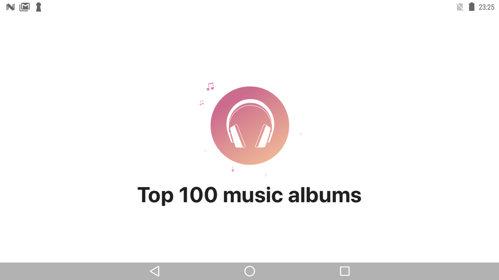

# Top 100 Music
Example application build on https://rss.applemarketingtools.com/ public API as an architecture test case.

The purpose of this application is to show usage of some basic libraries and architecture concepts:
* Clean architecture
* MVVM + BusinessFlow 
* Composer
* coroutines, flows
* Retrofit2
* Lottie

## Screen shots
|                    Splash                    |                Splash with connection error                |
|:--------------------------------------------:|:----------------------------------------------------------:|
|  |  |
|     List of albums - loading thumbnails      | List of albums - loading thumbnails error |
|  |  |
|                List of albums                | Album details |
|                |  |

## Screen shots in landscape orientation
|                    Splash                     |                Splash with connection error                |
|:---------------------------------------------:|:----------------------------------------------------------:|
|   | |
|                List of albums                 | List of albums - loading thumbnails error |
|  |  |
|          Album details - top section          | Album details - bottom section |
|                 |  |

## Video

Further development should be focused on:
* androidTests - Testing fragments and emitting ViewEvents
* Support edge cases of Activity <--> System interaction
* Support for animations and transitions
* Testing business flows. 
* Move snackBars/toasts? to composer.

